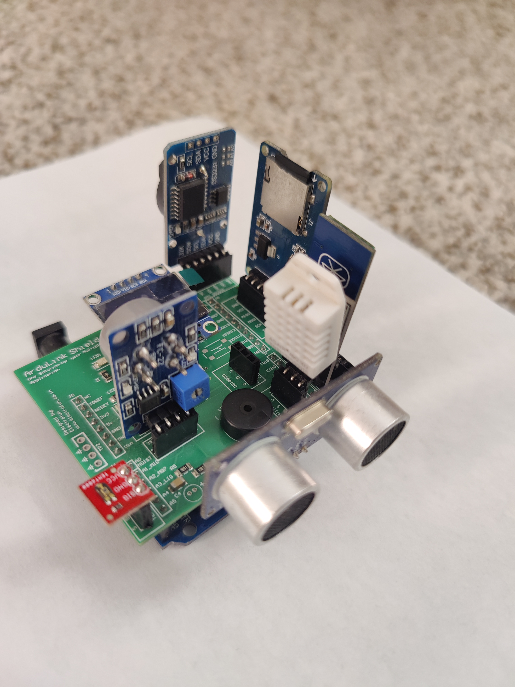

ArduLink Shield is a platform that brings many Arduino projects to life quickly without having to do a lot of breadboard connections.

 

ArduLink enables a modular plug and play approach for enthusiast to design and develop applications as suits their end goal. It is a tool that provides the ability to develop applications faster without worrying about hardware components.

 

![General Block Diagram]{Block_Diag-Block_Diagram_Shield.jpg)

 

#Pin Mapping

 

 

This repository includes test firmware to begin using ArduLink Shield

# Firmware Includes

1. Agriculture Monitoring Code
2. Ambient Light TEMT6000 Test
3. Bluetooth Test HC-05 Test
4. Button and Buzzen Tone Test
5. SD Card Datalogging Test
6. Temperature and Humidity DHT11/21 Test
7. OLED Display Test
8. OLED Display and RTC Test
9. Temperature Sensor DS18B20 Test
10. Microphone Test
11. Moisture Sensor Test
12. Gas Sensor MQ7 Test
13. NeoPixel Test
14. RTC and Datalogging Test
15. RTC Test
16. Digital to Analog Converter Test
17. Ultrasonic Sensor Test

